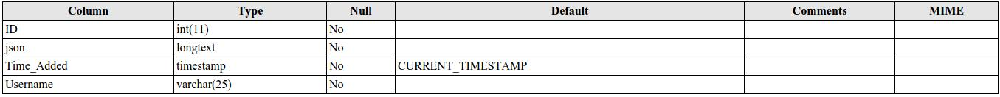
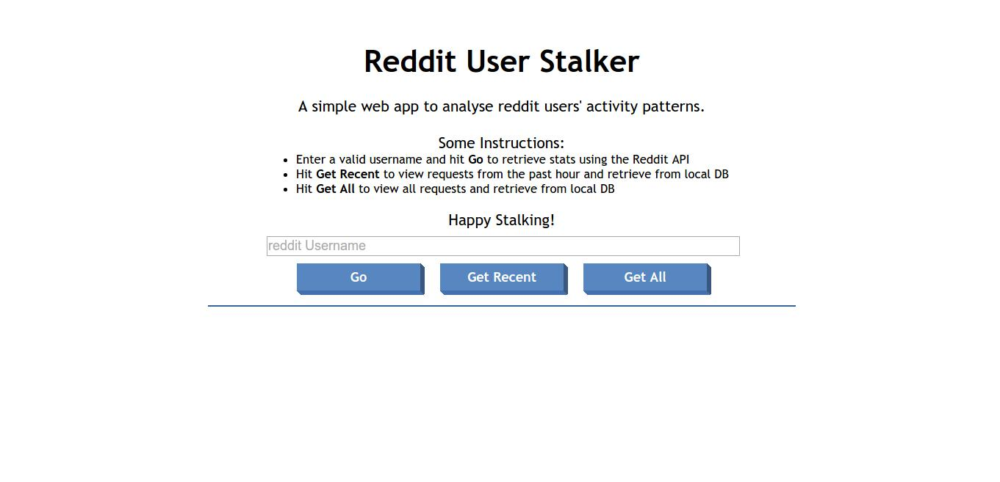
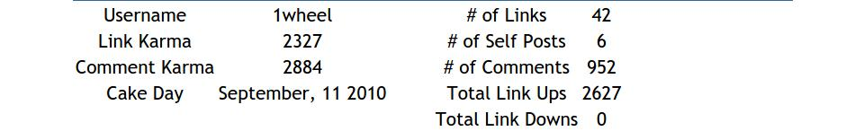
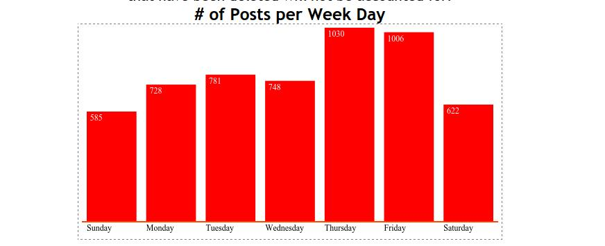
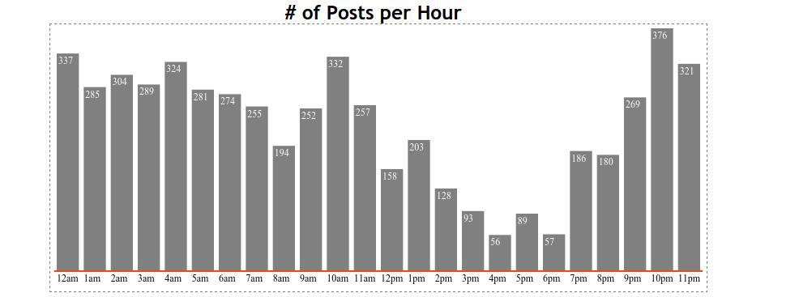
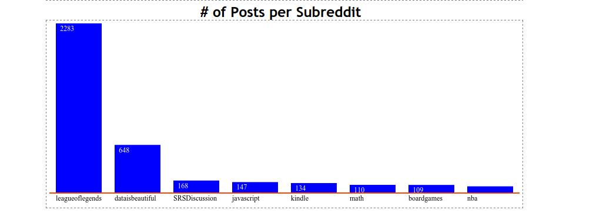

# ExploringRedditAPI
Getting to know APIs and how they work. What better place to start than Reddit?
It's nowhere close to perfect but you can try it out [here](http://101fbd7f.ngrok.com/).

###What the app does?
It retrieves public user data using Reddit's API, parsing through the json files, and gives you an insight into the User's activities through simple bar graphs (drawn using HTML5 canvas).

###What I used
1. Client Side
  1. HTML
  2. CSS
  3. Javascript/JQuery
2. Server Side
  1. PHP+MySQL (LAMP)

###Server Routes
The user interacts with only the homepage `index.html`. Everything else happens in the background.

###Build Instructions
There are only a few things to do after cloning the repo.
1. The Database
  - A single table is required
    - `CREATE TABLE DatabaseName.TableName (
      id            INT AUTO_INCREMENT,       
      json          LONGTEXT,
      Time_Added    TIMESTAMP ON UPDATE CURRENT_TIMESTAMP,
      Username      VARCHAR(25),
      PRIMARY KEY (id)
      );`
  - 
2. Edit the config.php file. Write in your Username, Password and DBName.
3. Just open index.html and play around

###Links to Download additional software
Its very well covered [here](https://www.digitalocean.com/community/tutorials/how-to-install-linux-apache-mysql-php-lamp-stack-on-ubuntu)

###Screenshots
1. 
2. 
3. 
4. 
5. 

####PS: And thanks to reddit user **1wheel**. I don't know who you are but I've used your stats for the screenshots. Hope you don't mind.

